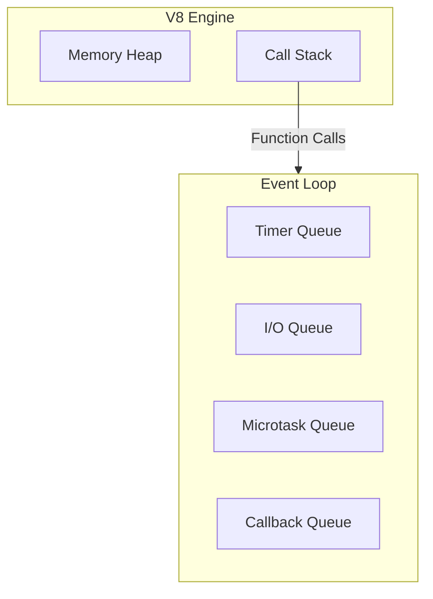

# Node.js Tutorial
YouTube [Playlist](https://www.youtube.com/watch?v=LAUi8pPlcUM&list=PLC3y8-rFHvwh8shCMHFA5kWxD9PaPwxaY)

_Node.js is an open-source, cross-platform **`JavaScript Runtime`**._

## History

### ECMAScript
- Language specification for JavaScript led by Technical Committee 39 (TC39)
- ECMAScript 2015(ES6) is where modern Javascript started and serves as base for all JS applications.

### Chrome's V8 Engine
- V8 is Google's open-source JavaScript engine launched in 2008.
- It implements ECMAScript specification using C++ language.
- It can run stand-alone (in a browser) or can be embedded in a C++ application (Node.js)

### JavaScript Runtime
Consists of,
  - V8 JS Engine
    - Callstack
    - Heap (Memory)
  - Browser APIs
    - DOM
    - Timer
    - Promises
    - Browser Storage
  - Event Loop
  - Callback Queue(Task Queue)
  - Microtask Queue

### Node.js JS Runtime
Consists of,
- Dependencies
  - **V8**
  - libuv
  - zlib
  - crypto etc.
- C/C++ implementations of ECMAScript Specs
- Below are some JS libraries (they use C++ utilities)
  - `fs.js`
  - `http2.js`
  - `timers.js`
  - `repl.js` etc.

- As a Node.js developer, we'd be using **JS Libraries** from above.

- There's no `window` or `document` in Node.js as there's no Browser API in Node.js

## Modules
- Each file is a module in Node.js
- 3 types,
  - Local modules (created by us)
  - In-built modules (out-of-the-box in Node.js)
  - Third-party modules (`npm` packages)

### Local Module
- Any JavaScript file with `.js` extension is a module in Node.js
- A module can be loaded by using `require()` function.
  ```js
  const add = require('./add.js');
  ```

### IIFE
- "*Immediately Invoked Function Expression*" is a JavaScript feature.
```js
  (function() {
    // an imported module code lives here
  })();
```

- Everytime, a module is loaded in Node.js, it's wrapped in IIFE with its own private scope which ensures encapsulation and avoid naming conflicts.

- When a Node.js module is loaded, it's wrapped in `IIFE` along with 5 parameters,
```js
  // Module Wrapper (not IIFE)
  
  (function(exports, require, module, __filename, __dirname) {
    // an imported module code lives here
  });
```

### Module Caching
- Caches a module if loaded once and uses the same object if loaded again in same file.
- Can be used for storing state (or Singleton behaviour)
- Helps avoid reloading same module multiple times.

> [!NOTE] Blog Topic
> What is Node.js module caching and its usecases? [Redit Thread](https://www.reddit.com/r/node/comments/x90rjn/eli5_what_is_module_caching_in_nodejs/)

## Import / Export Patterns

### `module.exports` vs `exports`
- Check `math.js` and `index.js` file for CommonJS patterns for importing and exporting.
- `exports` is an object pointing to `module.exports`
> [!IMPORTANT]
> - If you override the exports object by assigning it to an object literal, it'll break the object reference to `module.exports`.
> - Hence, in below code, the `module.exports` is an empty object `{}`.
```js
const add = (a, b) => a + b;
const subtract = (a, b) => a - b;

exports = { add, subtract} // module.exports is '{}'
```
Correct way to use the shorthand is,
```js
exports.add = (a, b) => a + b;
exports.subtract = (a, b) => a - b;
```

### ES Modules
- ECMAScript Modules or ESM
- It's required to use `.mjs` as file extension instead of `.js`.
- Check the `math-esm.mjs` and `main.mjs` module JS file for ES6 module patterns.

### Watch Mode in Node.js
You can run the Node.js program with `--watch` flag to enable watch mode and auto-reload when saving changes in the file or its dependencies.
```sh
node --watch index.js
```

## Build-in Modules
Eg. `path`, `events`, `fs`, `stream`, `http` etc.

### `path` module
- Utility to work with file and directory path.
- Methods: basename, extensionName, parse, format, isAbsolute, `join()`, resolve() methods.
- `join()` method returns the **normalized** path based on input params.
- `resolve()` method returns an **absolute** path based on input params.

#### Callback Pattern
- In JavaScript, a function is a first-class citizen, i.e. it can be passed as arguments and returned from functions.
- A function passed as a param to another function is called a "Callback function"
- `Synchronous` callback eg. are, Array.map(), Array.sort(), Array.filter() etc.
- `Asynchronous` callback eg.
  ```js
  document.addEventListener("click", callback)
  ```
  or
  ```js
  $.get("URL", (data) => {
    console.log(data);
  })
  ```

### `events` module
- Action or Occurence that can be responded.
- `node:events` module exports `EventEmitter` class with methods such as `on()`, `emit()` etc. that helps dispatch custom events and handle them.
- Check the `pizza-shop.js` file for example.
- Other built-in modules such `fs`, `stream` and `http` also rely heavily on `events` module for their event-driven patterns.

> [!NOTE]
> #### Character Set and Encoding
> - ASCII or Unicode is a character set, i.e. characters along with their numeric code.
> - UTF-8 is character encoding i.e. 8 bits (1 Byte) for storing each character. Eg. 4 will be stored as `00000100`.
> #### Stream & Buffers
> - **Stream** is a sequence of data moving from System A to System B.
> - **Buffer** is a temporary area where the data is kept before it can be processed.

### Asynchronous JavaScript
- JavaScript itself is `synchronous`, `blocking` and `single threaded`(main thread).
- Hence, it uses other APIs (eg. Browser APIs or NodeJS) to carry out Async tasks, such as network request, file read, user click events etc.
- With those APIs we can register a `function` to be executed later, asynchronously, based on certain events.

### `fs` module
- `fs` module has built-in methods to read/write file contents.
- It uses `Buffer` module internally.
- Methods:

  - `readFileSync(path, encoding)` Eg. for reading 'config' files
  - `readFile(path, encoding, callback)` with 'error-first' callback function
  - `writeFileSync(path, content, options)` with optional {flag: "a"} for appending content instead of overwriting
  - `writeFile(path, content, options, callback)`

- There's a `Promise()` based and `async/await` based version of `fs` module.
  ```js
  // index.js
  const fs = require("node:fs/promises");
  fs.readFile("./file.txt", "utf-8")
  .then((data) => console.log(data))
  .catch((error) => console.log(error));
  ```

  ```js
  // index.js
  const fs = require("node:fs/promises");
  async function fileRead() {
      try {
          const content = await fs.readFile("./file.txt", "utf-8")
          console.log(content);
      }
      catch(error) {
          console.log(error);
      }
      
  }
  fileRead(); // call async module or directly use 'await' statement when inside '.mjs' module file.
  ```

#### Streams
- `Stream` allows us to work with chunks of data, rather than large amount of data.
- Types of streams,
  - Readable Stream (Read from file)
  - Writable Stream (Write to file)
  - Duplex Stream (Socket)
  - Transform Stream (eg. Compress/Decompress a file)

#### Pipe
- Another way to `read` and `write` is using the `pipe()` method on `ReadStream` object.
  ```js
  // declare read stream
  // declare write stream
  readStream.pipe(writeStream);
  ```
- We can also chain the response of `pipe()` method, provided it's not a **writeStream**.
  ```js
  const zlib = require("node:zlib");
  const gzip = zlib.createGzip();
  readStream.pipe(gzip).pipe(fs.WriteStream("./file2.txt.gz"));
  ```

### `http` module
- Allows creation of Web server to handle client's HTTP request.
  ```js
  const http = require("node:http");
  const PORT = 3001;
  const server = http.createServer((req, res) => { // callback listener
      res.writeHead(200, {"Content-Type": "text/plain"}); // response headers
      res.end("Last Chunk!"); // end the response with final chunk
  });
  server.listen(PORT, () => console.log(`Server running on Port: ${PORT}`));
  ```

- Important Headers:
  - `Content-Type`: `"text/plain"` | `"application/json"`

- To send a `JSON` as a response, we'll need to specify header `Content-Type` as `application/json` and convert response object to JSON string `JSON.stringify(dataObj)`
- To send HTML as a response, we can change the `Content-Type` to `text/html` in header and send the HTML code as response data.
  - Or we can create an external file (eg. `index.html`) and read that using `fs` module and send it as a response.
  ```js
  const http = require("node:http");
  const fs = require("node:fs");
  const PORT = 3001;
  const server = http.createServer((req, res) => {
      res.writeHead(200, {"Content-Type": "text/html"});
      /* Read using 'fs' module */
      const html = fs.readFileSync("./index.html", "utf-8")
      res.end(html);
      
      // OR for better performance
      /* Use buffer stream and 'pipe' to 'res' */
      // fs.createReadStream(__dirname + "/index.html").pipe(res);
  });
  server.listen(PORT, () => console.log(`Server running on Port: ${PORT}`));
  ```
- The dynamic strings can be inserted in HTML file using `htmlStr.replace("{{var_name}}", value)` method.

#### Handling Routes in Server
- You can use the `req.url` and `req.method` properties from `req` object to send different response based on `url` and HTTP `method`.

  ```js
    const url = req.url;
    switch(url) {
        case "/":
            res.writeHead(200, {"Content-Type": "text/plain"});
            res.end("Home Page");
            break;
        case "/about":
            res.writeHead(200, {"Content-Type": "text/plain"});
            res.end("About Page");
            break;
        case "/api":
            res.writeHead(200, {"Content-Type": "application/json"});
            res.end(JSON.stringify({
                firstName: "Prakash",
                lastName: "Upadhyay",
            }));
            break;
        default:
            res.writeHead(400);
            res.end("Resource not found!")
    }
  ```

> [!NOTE]
> There are web frameworks that can ease our job when handling http request for large applications. Eg. `Express.js`, `Nest.js` etc.

### Node Runtime
- Node.js runtime has external dependencies such as `V8`, `libuv`, `zlib`, `crypto` etc.
- `libuv` provides the asynchronous features to Node.js

### `libuv` library
- What: It's a cross-platform, open-source library written in C language.
- Why: It helps Node.js with asynchronous, non-blocking operations
- How: Using `Thread Pool` and `Event Loop`

#### `cypto` module
- Every method in Node.js with suffix `"Sync"` always runs on **main** thread of the CPU and is blocking.
- For eg. calling `crypto.pbkdf2Sync()` multiple times, takes linear time based on number of times we call it.
- But the `async` method such as `crypto.pbkdf2()` , runs on a separate thread in `libuv`'s thread pool.
- The `libuv` thread pool has default size of 4. But we can increase the size using environment variable `UV_THREADPOOL_SIZE` depending on how many cores our CPU has.
  ```js
  process.env.UV_THREADPOOL_SIZE = 6;
  ```

#### `https` module
- Unlike, `crypto` module method `pbkdf2()`, the `https.request()` is a Network I/O operation and not a CPU-bound task. It's handed over to the host Operating System by the `libuv`. Eg. MacOS uses kqueue for handling native async tasks.

  ```js
  const https = require("node:https");
  const MAX_ITERATIONS = 50;
  const start = Date.now();
  for(let i = 0; i < MAX_ITERATIONS; i++) {
      https.request("https://google.com", (res) => { // Network I/O operation
          res.on("data", () => {});
          res.on("end", () => {
              console.log(`Request: ${i+1}`, Date.now() - start);
          });
      })
      .end();
  }
  ```
- This is also a reason why it took almost the same time for 16 or 40 network requests.

> [!IMPORTANT]
> 1. Thread pool will handle the File I/O or CPU intensive tasks if there's no native async support in the host OS.
> 2. Thread pool helps with Async tasks, but can be a bottleneck if all threads are busy.

### Event Loop
- JavaScript is a synchronous, blocking, single-threaded language.
- To handle asynchronity, Node.js uses `libuv` library.
- "Event Loop" is part of `libuv` library and written in C language. It coordinates the execution of Sync and Async code.
- It maintains multiple queue data structures with registered `Callbacks`(CB) from the async code.



#### Callback (`CB`) Queues
There are 6 queues maintained for the event loop to work. Those are,
- Timer queue (`setTimeout()` and `setInterval()`)
- I/O queue (file I/O and network I/O)
- Check queue
- Close queue
- Microtask queue (this is not part of `libuv`)
  - `nextTick` queue
  - `Promise` queue

- Sequence of Callbacks in event loop,

  Timer queue &rarr; "*Microtask queue*" &rarr; I/O queue &rarr; "*Microtask queue*" &rarr; Check queue &rarr; "*Microtask queue*" &rarr; Close queue &rarr; "*Microtask queue*"
  
  (within Microtask queue, `nextTick` queue is executed, followed by `promise` queue)


> [!TIP]
> #### Event Loop
> 1. All user-written `sync` code takes priority over any `async` callback waiting in the queues.
> 2. All `CB` in **nextTick** queue is executed before `CB` in **Promise** queue.
> 3. 

> [!CAUTION]  
> Usage of `nextTick()` is discouraged, as it can starve the event loop, because control will never make outside the `MicroTask` queue.

## Glossary
- JavaScript
- ECMAScript
- TC39
- V8
- JS Engine
- JS Runtime
- REPL (Read-Evaluate-Print-Loop)
- IIFE (Immediately Invoked Function Expression)
- ESM


## References
### Event Loop
- [The Difference in Event Loop between JavaScript and Node.js](https://wearecommunity.io/communities/aep-js-community/articles/2893#:~:text=In%20the%20browser%20runtime%2C%20the,js.)